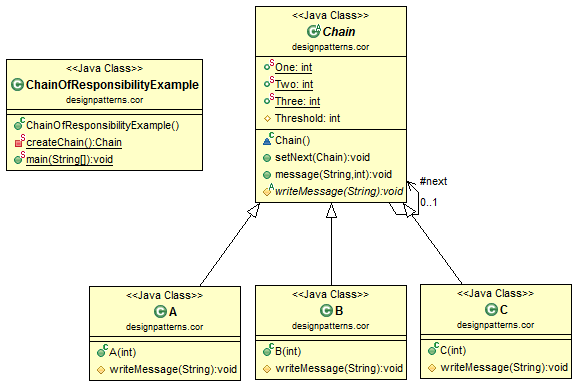

# Java Design Pattern: Chain of Responsibility

###### The main idea of Chain of Responsibility design pattern is to build a chain of processing unit, each unit handle the request if threshold is satisfied. Since a chain is built, if one unit is not satisfied, it's next unit will be tested, and so on. Each request will be process along the chain.

> "Avoid coupling the sender of a request to its receiver by giving more than one
object a chance to handle the request. Chain the receiving objects and pass the
request along the chain until an object handles it."

### Chain of Responsibility Class Diagram

[]

### Output
```sh
Receiver A: level 3
Receiver A: level 2
Receiver B: level 2
Receiver A: level 1
Receiver B: level 1
Receiver C: level 1
```
source:
- [simple-java](https://www.programcreek.com/2011/01/an-java-example-of-observer-pattern/) 
- [w3sdesign](http://www.w3sdesign.com/index0100.php)