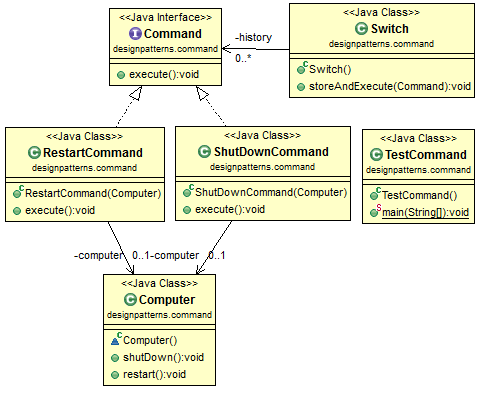

# Java Design Pattern: Command

###### Command design pattern takes an operation and its arguments and wraps them up in an object to be executed, logged, etc. In the example below, Command is an operation, its argument is a Computer, and they are wrapped in Switch.

###### In another perspective, Command pattern has 4 parts: command, receiver, invoker and client. In this example, Switch is the invoker, and Computer is the receiver. A concrete Command has a receiver object and invoke the receiver's method. Invoker can use different concrete command. The client determines which command to use for the receiver.

> "Encapsulate a request as an object, thereby letting you parameterize clients with different requests, queue or log requests, and support undoable opera­tions."

[]

### Output
```sh
computer is shut down
```

source:
- [simple-java](https://www.programcreek.com/2013/02/java-design-pattern-factory/) 
- [w3sdesign](http://www.w3sdesign.com/index0100.php)