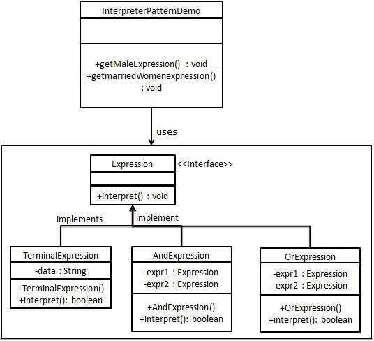

# Java Design Pattern: Interpreter

###### Interpreter pattern provides a way to evaluate language grammar or expression. This type of pattern comes under behavioral pattern. This pattern involves implementing an expression interface which tells to interpret a particular context. This pattern is used in SQL parsing, symbol processing engine etc.

> "Given a language, define a representation for its grammar along with an inter­preter that uses the representation to interpret sentences in the language."

### Implementation

###### We are going to create an interface Expression and concrete classes implementing the Expression interface. A class TerminalExpression is defined which acts as a main interpreter of context in question. Other classes OrExpression, AndExpression are used to create combinational expressions.

###### InterpreterPatternDemo, our demo class, will use Expression class to create rules and demonstrate parsing of expressions.
  
[]

### Output
```sh
John is male? true
Julie is a married women? true
```

source:
- [tutorials-point](https://www.tutorialspoint.com/design_pattern/interpreter_pattern.htm)
- [w3sdesign](http://www.w3sdesign.com/index0100.php)