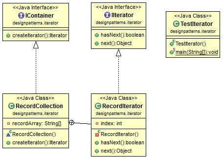

# Java Design Pattern: Iterator

###### Iterator pattern is used to iterate through a collection of objects. It is a commonly used pattern, you probably have used it before. Whenever you sees something like hasNext() and next(), it is probably a iterator pattern. For example, you may iterate through a list of database query record.

> "Provide a way to access the elements of an aggregate object sequentially
without exposing its underlying representation."

[]


### Output
```sh
first
second
third
fourth
fifth
```

### Iterator Pattern used in JDK

###### In java.util package, the Iterator interface is defined as follows:
```sh
public interface Iterator<E> {
    boolean hasNext();
    E next();
    void remove();
}
```

source:
- [simple-java](https://www.programcreek.com/2013/02/java-design-pattern-iterator/) 
- [w3sdesign](http://www.w3sdesign.com/index0100.php)