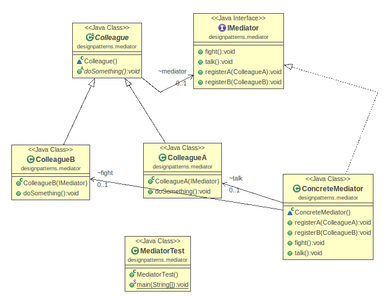

# Java Design Pattern: Mediator

###### Mediator design pattern is used to collaborate a set of colleagues. Those colleagues do not communicate with each other directly, but through the mediator.

> "Define an object that encapsulates how a set of objects interact. Mediator
promotes loose coupling by keeping objects from referring to each other
explicitly, and it lets you vary their interaction independently."

###### In the example below, Colleague A want to talk, and Colleague B wants to fight. When they do some action(i.e., doSomething()), they invoke mediator to do that.

[]

###### Among other behavioral pattern, Observer is the most similar pattern with Mediator. You can read Observer pattern to compare the difference.

### Output
```sh
Mediator is talking
Mediator is fighting
```

source:
- [simple-java](https://www.programcreek.com/2013/02/java-design-pattern-mediator/) 
- [w3sdesign](http://www.w3sdesign.com/index0100.php)