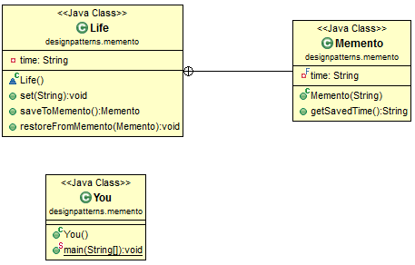

# Java Design Pattern: Mediator

###### Basically, what it does is to allow an object to go back to a state.

> "Without violating encapsulation, capture and externalize an object's internal
state so that the object can be restored to this state later."

###### In the following example, You can time travel to any era for your Life, and You can restore to a previous era you have been to.

[]

### Output
```sh
Mediator is talking
Mediator is fighting
```

| Advantages (+) | Disadvantages (–) |
| ------ | ------ |
| Preserves encapsulation. | May introduce run-time costs. |
| An object's internal state can be saved externally (to another object) without violating encapsulation (without making the internal data structures accessible). | Creating large numbers of mementos with large amounts of data may impact memory usage and system performance. |
|  | "Unless encapsulating and restoring Originator state is cheap, the pattern might not be appropriate." |

source:
- [simple-java](https://www.programcreek.com/2013/02/java-design-pattern-memento/)
- [w3sdesign](http://www.w3sdesign.com/index0100.php)