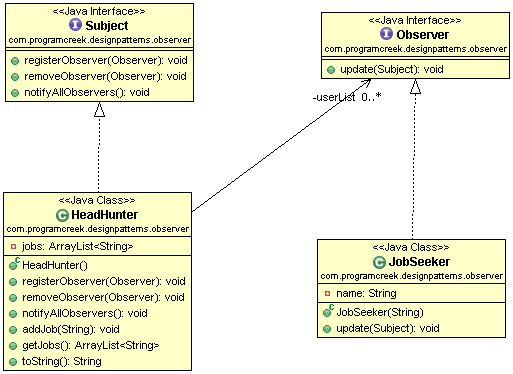

# Java Design Pattern: Observer (Listener)

###### In brief, Observer Pattern = publisher + subscriber.

###### Observer pattern has been used in GUI action listener. Swing GUI example shows how action listener works like an observer.

> "Define a one-to-many dependency between objects so that when one object
changes state, all its dependents are notified and updated automatically."

###### The following is a typical example about head hunter. There are two roles in this diagram - HeadHunter and JobSeeker. Job seekers subscribe to a head hunter, and head hunter notifies job seekers when there is a new job opportunity.

[]

### Output
```sh
Mike got notified!
[Google Job]
Chris got notified!
[Google Job]
Jeff got notified!
[Google Job]
Mike got notified!
[Google Job, Yahoo Job]
Chris got notified!
[Google Job, Yahoo Job]
Jeff got notified!
[Google Job, Yahoo Job]
```

### Observer pattern in JDK
```sh
java.util.EventListener
```


source:
- [simple-java](https://www.programcreek.com/2011/01/an-java-example-of-observer-pattern/)
- [w3sdesign](http://www.w3sdesign.com/index0100.php)