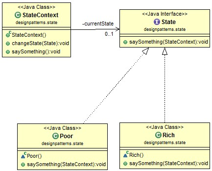

# Java Design Pattern: State

###### State Design Pattern is mainly for changing state at run-time.

> "Allow an object to alter its behavior when its internal state changes.
The object will appear to change its class."

### State pattern story

###### People can live with different financial status. They can be rich or they can be poor. The two states - rich and poor - can be converted to each other from time to time. The idea behind the example: people normally work harder when they are poor and play more when they are rich. What they do depends on the state in which they are living. The state can be changed based on their actions, otherwise, the society is not fair.

### State pattern class diagram

[]

### Output
```sh
I'm poor currently, and spend much time working. 
I'm rick currently, and play a lot.
I'm poor currently, and spend much time working. 
I'm rick currently, and play a lot.
```

source:
- [simple-java](https://www.programcreek.com/2011/07/java-design-pattern-state/) 
- [w3sdesign](http://www.w3sdesign.com/index0100.php)