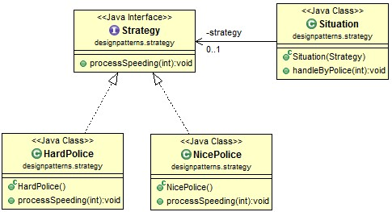

# Java Design Pattern: Strategy (Policy)

###### Strategy pattern is also called policy pattern.

> "Define a family of algorithms, encapsulate each one, and make them interchange­able. Strategy lets the algorithm vary independently from clients that use it."

### Strategy pattern story

###### Here is a story about Strategy pattern. Suppose Mike sometimes speeds when driving, but he doesn't always do that. He may be stopped by a police officer. It's possible that the police is very nice, who would let him go without any ticket or with a simple warning. (Let call this kind of police "NicePolice".) Also it's possible that he may be caught by a hard police and gets a ticket. (Let's call this kind of police "HardPolice".) He doesn't know what kind of police would stop him, until he actually gets caught, that is, run-time. This is the whole point of Strategy pattern.

[]

### Output
```sh
Your speed is 10, and should get a ticket!
This is your first time, be sure don't do it again!
```

### Strategy Pattern in JDK

```sh
1). Java.util.Collections#sort(List list, Comparator < ? super T > c)
2). java.util.Arrays#sort(T[], Comparator < ? super T > c)
```

###### The sort method use different Comparator in different situations.

source:
- [simple-java](https://www.programcreek.com/2011/01/a-java-example-of-strategy-design-pattern/) 
- [w3sdesign](http://www.w3sdesign.com/index0100.php)