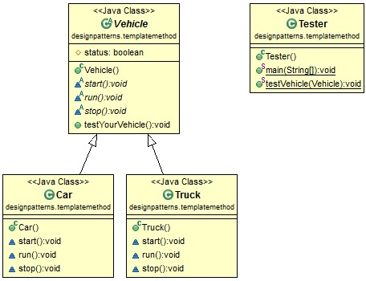

# Java Design Pattern: Template Method

###### The Template Method design pattern defines the workflow for achieving a specific operation. It allows the subclasses to modify certain steps without changing the workflow's structure.


> "Define the skeleton of an algorithm in an operation, deferring some steps to sub­classes. Template Method lets subclasses redefine certain steps of an algorithm without changing the algorithm's structure."

###### The following example shows how Template Method pattern works.

[]

### Output
```sh
Car Run fast!
Car stop!
Truck Run slowly!
Truck stop!
```

###Real usage of Template Method Pattern

###### This pattern is used in Spring framework's Data Access Object(DAO). org.springframework.jdbc.core.JdbcTemplate class has all the common repeated code blocks related with JDBC workflow, such as update, query, execute, etc.


source:
- [simple-java](https://www.programcreek.com/2012/08/java-design-pattern-template-method/) 
- [w3sdesign](http://www.w3sdesign.com/index0100.php)