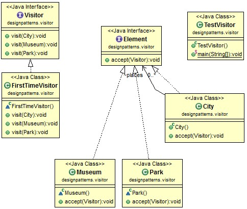
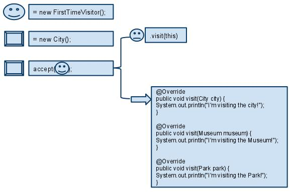

# Java Design Pattern: Visitor

###### Visitor pattern is a design pattern commonly used in the parser of a compiler, such as Eclipse JDT AST Parser.

> "Represent an operation to be performed on the elements of an object structure.
Visitor lets you define a new operation without changing the classes of the elements on which it operates."

###### Basically, there are two interfaces - Visitor and Element - in Visitor pattern.

### Visitor pattern story

###### Suppose a first time visitor comes to New York City. He want to visit the city and the city accepts his visit. Once the visitor starts visit, it automatically visit everything, and he doesn't need to call a method when he wants to go to a museum. The travel is a package!

[]

### Steps of Visitor pattern

###### This diagram shows the steps of visiting.

[]

### The working process is like the following:

| Nº | Java code |
| ------ | ------ |
| 1. | A visitor FirstTimeVisitor and an element City are created. |
| 2. | Program starts with "City accept a visitor". |
| 3. | The accept method in City defines that let this visitor to visit. |
| 4. | Accepted visitor call it's overloaded method "visit" to visit this City. |

### Output

```sh
City is accepting visitor.
I'm visiting the city!
Museum is accepting visitor.
I'm visiting the Museum!
Park is accepting visitor.
I'm visiting the Park!
```

### Visitor pattern in JDK

```sh
javax.lang.model.element.AnnotationValue
```
###### Obviously use Visitor pattern, but it is not commonly used in regular projects.


source:
- [simple-java](https://www.programcreek.com/2011/05/visitor-design-pattern-example/) 
- [w3sdesign](http://www.w3sdesign.com/index0100.php)