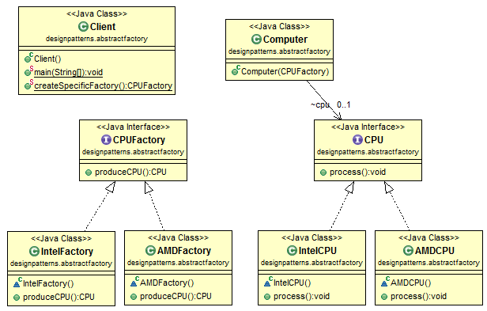

# Java Design Pattern: Abstract Factory

###### Abstract Factory pattern adds another layer of abstraction for Factory pattern. If we compare Abstract Factory with Factory, it is pretty obvious that a new layer of abstraction is added. Abstract Factory is a super-factory which creates other factories. We can call it "Factory of factories".

>"Provide an interface for creating families of related or dependent objects
without specifying their concrete classes."

[]

###### source:
- [simple-java](https://www.programcreek.com/2013/02/java-design-pattern-abstract-factory/) 
- [w3sdesign](http://www.w3sdesign.com/index0100.php)