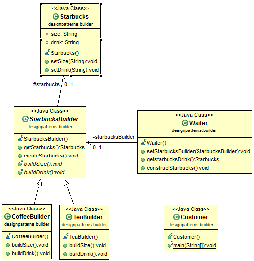

# Java Design Pattern: Builder

###### The key feature of Builder pattern is that it involves a step-by-step process to build something, i.e., every produce will follow the same process even though each step is different.

>"Separate the construction of a complex object from its representation so that
the same construction process can create different representations."

###### In the following example, we can define a drink builder called StarbucksBuilder which will build a Starbucks drink. StarbucksBuilder has several steps to build a Starbucks drink, such as buildSize() and buildDrink(). And finally return the drink built.

[]

### Real Usage of Builder Design Pattern

###### Builder pattern has been used in a lot of libraries. However, there is a common mistake here. Consider the following example of StringBuilder which is a class from Java standard library. Does it utilize the Builder pattern?
```sh
StringBuilder strBuilder= new StringBuilder();
strBuilder.append("one");
strBuilder.append("two");
strBuilder.append("three");
String str= strBuilder.toString();
In Java standard library, StringBuilder extends AbstractStringBuilder.
```
###### The append() method is one step of the process, just like a step in our Starbucks example. The toString() method is another and it is the last step. However, the difference here is that there is no waiter in the picture. The Waiter class plays the director role in the picture of the Builder pattern. Since there is no such role, it is not a Builder pattern.

###### Of course, this is not the only reason. You can compare with the class diagram at the beginning and find out another reason.

### Difference between Builder and Factory

###### Builder pattern is used when there are many steps to create an object. Factory pattern is used when the factory can easily create the entire object within one method call.


source:
- [simple-java](https://www.programcreek.com/2013/02/java-design-pattern-builder/) 
- [w3sdesign](http://www.w3sdesign.com/index0100.php)