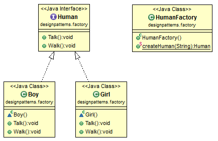

# Java Design Pattern: Factory

###### Factory design pattern is used for creating an object based on different parameters. The example below is about creating human in a factory. If we ask the factory for a boy, the factory will produce a boy; if we ask for a girl, the factory will produce a girl. Based on different parameters, the factory produce different stuff.

>"Define an interface for creating an object, but let subclasses decide which class
to instantiate. Factory Method lets a class defer instantiation to sub­classes."
 

[]

### Factory design pattern used in Java standard library

###### Based on different parameter, getInstance() returns a different instance of Calendar.

```sh
java.util.Calendar - getInstance()
java.util.Calendar - getInstance(TimeZone zone)
java.util.Calendar - getInstance(Locale aLocale)
java.util.Calendar - getInstance(TimeZone zone, Locale aLocale)
java.text.NumberFormat - getInstance()
java.text.NumberFormat - getInstance(Locale inLocale)
```

source:
- [simple-java](https://www.programcreek.com/2013/02/java-design-pattern-factory/) 
- [w3sdesign](http://www.w3sdesign.com/index0100.php)