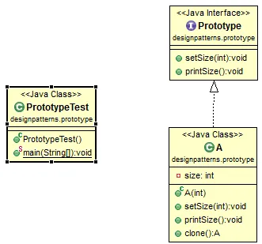

# Java Design Pattern: Prototype

###### Prototype design pattern is used when very similar objects are frequently created. Prototype pattern clones objects and set the changed feature. In this way, less resources are consumed.

>"Specify the kinds of objects to create using a prototypical instance,
and create new objects by copying this prototype."

[]

### Prototype Design Pattern Used in Java Standard Library

```sh
java.lang.Object - clone()
```

source:
- [simple-java](https://www.programcreek.com/2013/02/java-design-pattern-prototype/)
- [w3sdesign](http://www.w3sdesign.com/index0100.php)