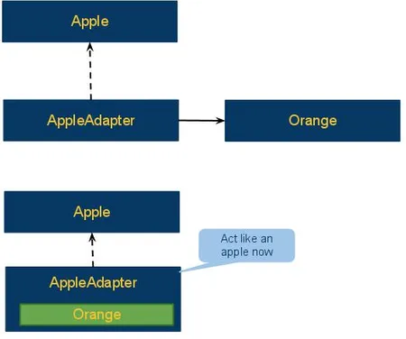
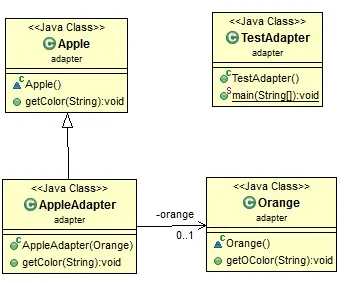

# Java Design Pattern: Adapter

###### Adapter pattern is frequently used in modern Java frameworks.

###### It comes into place when you want to use an existing class, and its interface does not match the one you need, or you want to create a reusable class that cooperates with unrelated classes with incompatible interfaces.

>"Convert the interface of a class into another interface clients expect.
Adapter lets classes work together that couldn't otherwise because of
incompatible interfaces."

### Adapter pattern story

###### The Adapter idea can be demonstrated with the following simple example. The purpose of the sample problem is to adapt an orange as an apple.

[]

###### From the lower diagram, the adapter contains an instance of Orange, and extends Apple. It seems to be that after an Orange object gets a adapter skin, it acts like an Apple object now.

### Adapter class diagram

[]

###### Indeed, this probably is the simplest idea about adapter pattern. A double-way adapter may be used more often. To make a double-channel adapter, adapter requires to implements two interfaces and contains the two instances. It is still a simple idea.

### Adapter Pattern used in Java SDK
```sh
java.io.InputStreamReader(InputStream) (returns a Reader)
java.io.OutputStreamWriter(OutputStream) (returns a Writer)
```

###### In a real large framework, the idea may not be very apparent. E.g. How the Adapter idea is used in Eclipse is not so easy to discover. This is a post towards how it is used in Eclipse Runtime.


source:
- [simple-java](https://www.programcreek.com/2011/09/java-design-pattern-adapter/) 
- [w3sdesign](http://www.w3sdesign.com/index0100.php)