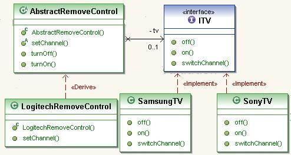

# Java Design Pattern: Bridge

###### In brief, Bridge Design Pattern is a two layer abstraction.

> "Decouple an abstraction from its implementation
so that the two can vary independently."

### Bridge pattern story

###### The example of TV and Remote Control(typo in diagram) can demonstrate the two layers of abstraction. You have an interface for TV and an abstract class for remote control. As you know, it is not a good idea to make a concrete class for either of them, because other vendors may make different implementations.

[]

###### In summary, Bridget pattern allows two layers of abstraction of implementation, in this case, TV and remote control. Therefore, it gives more flexibility.

source:
- [simple-java](https://www.programcreek.com/2013/02/java-design-pattern-factory/) 
- [w3sdesign](http://www.w3sdesign.com/index0100.php)