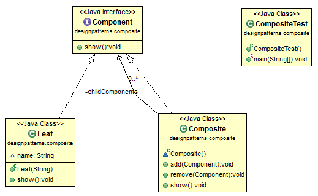
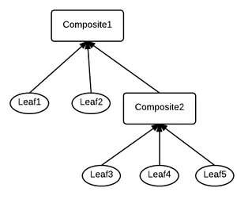

# Java Design Pattern: Composite

###### Composite pattern is relatively simple, but it has been used in many designs, such as SWT, eclipse workspace, etc. It basically produce a hierarchical tree which can be accessed by using a uniform method.

>"Compose objects into tree structures to represent part-whole hierarchies. Composite lets clients treat individual objects and compositions of objects uniformly."

[]

### The following code implements the following tree structure.

[]

source:
- [simple-java](https://www.programcreek.com/2013/02/java-design-pattern-composite/) 
- [w3sdesign](http://www.w3sdesign.com/index0100.php)