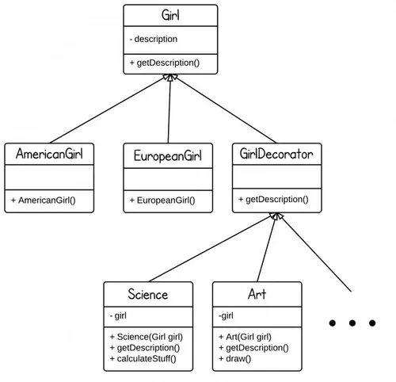

# Java Design Pattern: Decorator

>"Attach additional responsibilities to an object dynamically. Decorators provide a flexible alternative to subclassing for extending functionality."

###### Decorator pattern adds additional features to an existing object dynamically. In this post, I will use a simple example - decorate your girlfriend - to illustrate how decorator pattern works.

### Decorator Pattern Story

###### Let's assume you are looking for a girlfriend. There are girls from different countries such as America, China, Japan, France, etc. They may have different personalities and hobbies. In a dating web like eharmony.com, if each type of girl is an individual Java class, there would be thousands of classes. That is a serious problem called class explosion. Moreover, this design is not extensible. Whenever there is a new girl type, a new class needs to be created.

###### Let's change the design, and let each hobby/personality becomes a decorator which can be dynamically applied to a girl.

[]

###### Girl is the abstract class at the top level, we have girls from different countries. With a GirlDecorator class, we can decorator each girl with any feature by adding a new decorator.

##### Output:
```sh
+American
+American+Like Science
+American+Like Science+Like Art
```
##### We can also do something like this:

```sh
Girl g = new Science(new Art(new AmericanGirl()));
```
###  Decorator Pattern Used in Java Stand Library

###### A typical usage of Decorator pattern is Java IO classes.

###### Here is a simple example - BufferedReader decorates InputStreamReader.

```sh
BufferedReader input = new BufferedReader(new InputStreamReader(System.in));
//System.in is an InputStream object
```

###### InputStreamReader(InputStream in) - bridge from byte streams to character streams. InputSteamReader reads bytes and translates them into characters using the specified character encoding.

###### BufferedReader(Reader in) - read text from a character stream and buffer characters in order to provide efficient reading methods(e.g., readLine())


source:
- [simple-java](https://www.programcreek.com/2012/05/java-design-pattern-decorator-decorate-your-girlfriend/) 
- [w3sdesign](http://www.w3sdesign.com/index0100.php)