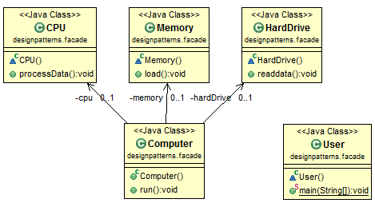

# Java Design Pattern: Facade

>"Provide an unified interface to a set of interfaces in a subsystem.
Facade defines a higher-level interface that makes the subsystem
easier to use."

###### Facade design pattern hides complexity of a task and provides a simple interface. The startup of a computer is a good example. When a computer starts up, it involves the work of cpu, memory, hard drive, etc. To make it easy to use for users, we can add a facade which wrap the complexity of the task, and provide one simple interface instead.

### Facade Pattern Class Diagram

[]

### Example in Real Project

###### In javax.faces.context, ExternalContext internally uses ServletContext, HttpSession, HttpServletRequest, HttpServletResponse, etc. It allows the Faces API to be unaware of the nature of its containing application environment.

###### This example is based on Facade design pattern in Wiki, so the credit is given to Wiki.

### Output

```sh
CPU is processing data...
Memory loading...
HardDrive is reading data...
```

source:
- [simple-java](https://www.programcreek.com/2013/02/java-design-pattern-facade/) 
- [w3sdesign](http://www.w3sdesign.com/index0100.php)