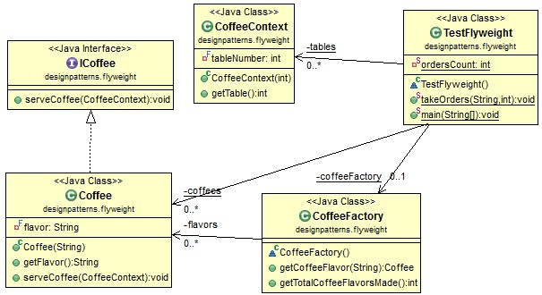

# Java Design Pattern: Flyweight

###### Flyweight pattern is used for minimizing memory usage. What it does is sharing as much data as possible with other similar objects.

>"Use sharing to support large numbers of fine-grained objects efficiently."

### Flyweight Pattern Class Diagram

[]

### Output

###### Check out the output below, coffee is served to 10 tables, but only 2 coffees are created ever!

```sh
Coffee is created! - Cappuccino
Coffee is created! - Regular Coffee
Serving Cappuccino to table 2
Serving Cappuccino to table 2
Serving Regular Coffee to table 1
Serving Regular Coffee to table 2
Serving Regular Coffee to table 3
Serving Regular Coffee to table 4
Serving Cappuccino to table 4
Serving Cappuccino to table 5
Serving Regular Coffee to table 3
Serving Cappuccino to table 3

Total Coffee objects made: 2
```

source:
- [simple-java](https://www.programcreek.com/2013/02/java-design-pattern-flyweight/) 
- [w3sdesign](http://www.w3sdesign.com/index0100.php)