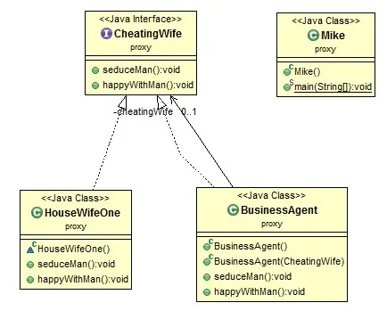

# Java Design Pattern: Proxy/Agent pattern

> "Provide a surrogate or placeholder for another object
to control access to it."

###### I’m too busy to response your request, so you go to my proxy. Proxy should know what the delegator can do. That is, they have the same interface. The proxy can not do the job, but the delegator can do. The characters you do not understand can be totally ignored!

[]

### Proxy pattern story

###### Some bad man, for whatever reasons, always wants to sleep with some good man's wife. Among those wives, some want to sleep with those bad men, but others do not. The bad men can not ask directly to those wives. Because they are not sure whether the one being asked would like to do bad things. It would be a very bad situation if he makes a bad judgement. So there should be an agent/proxy to do this kind of business for those bad men.

#### We have the following roles in this situation.


- CheatingWife/SluttyWife: a interface which define what they usually do, such as seduce men and happy with men.
- HouseWifeOne (Britney): she is a slutty wife at home.
- Mike: who wants to sleep with other men’s wives.
- Business Agent: do this kind of consulting business.


#### Steps

| Nº | Java code |
| ------ | ------ |
| 1. | Define the cheating wife’s type |
| 2. | Define a cheating wife No. 1 |
| 3. | Define the bad agent |
| 4. | Let the bad men start doing bad things |

### Output

```sh
I'm Britney...
Britney seduce men, she acts like such a bitch ...
Britney is happy with man ...
```

source:
- [simple-java](https://www.programcreek.com/2013/02/java-design-pattern-factory/) 
- [w3sdesign](http://www.w3sdesign.com/index0100.php)
